# 📊 AWS CloudWatch Alarm with SNS Notification — Lab Guide

This project demonstrates how to monitor an EC2 instance using **Amazon CloudWatch** and send alerts via **Amazon SNS** when the instance exceeds a defined CPU usage threshold. You'll set up a metric alarm, subscribe to notifications via email, and test the setup using the `stress` tool.

---

## 📘 Overview

### 🔹 CloudWatch

Amazon CloudWatch is a monitoring and observability service designed to collect and track metrics, logs, and events. It is commonly used to:

- Trigger alarms when thresholds are crossed
- Monitor AWS services (like EC2)
- Visualize performance metrics


> **CloudWatch Monitoring Types:**
>
> | Type              | Interval       | Cost     |
> |-------------------|----------------|----------|
> | Basic Monitoring  | 5 minutes      | Free     |
> | Detailed Monitoring | 1 minute     | Paid     |

### 🔹 Amazon SNS

Amazon Simple Notification Service (SNS) is a fully managed messaging service for sending messages to subscribing endpoints (email, SMS, etc.).

> - **Topic**: The communication channel
> - **Subscription**: Destination (email/SMS)
> - **Publisher**: CloudWatch alarm triggers SNS

---

## 🎯 Lab Objectives

1. Create SNS Topic with Email Notification
2. Configure Email Subscription
3. Create a CloudWatch Alarm (CPU ≥ 5%) attached to EC2
4. Install and run `stress` to simulate high CPU usage
5. Observe behavior of CloudWatch, SNS, and Email alerts

---

## 🧪 Step-by-Step Instructions

### ✅ Step 1: Create SNS Topic

Navigate to **Amazon SNS > Topics > Create topic**.

- **Type**: Standard
- **Name**: `FirstSNSTopic`


---

### ✅ Step 2: Set Basic Access Policy

Select the default access policy to allow CloudWatch to publish alerts.


---

### ✅ Step 3: Review Delivery Policy

Optional: Review or modify retry settings for message delivery.


---

### ✅ Step 4: Create Email Subscription

- Go to **Subscriptions > Create Subscription**
- Choose **Protocol**: Email
- Enter your **Email Address**


---

### ✅ Step 5: Confirm Email Subscription

Check your email inbox and confirm the subscription link.


---

### ✅ Step 6: Attach CloudWatch Alarm to EC2

- Go to **EC2 > Instances**
- Select your instance
- Click **Actions > Monitor and troubleshoot > Manage CloudWatch Alarms**


---

### ✅ Step 7: Create Alarm for CPU Utilization

- Metric: `CPUUtilization`
- Threshold: `≥ 5%`
- Evaluation Period: 1 (5-minute period)
- Action: Send notification to `FirstSNSTopic`


View current CPU metrics before setting:


Choose the SNS topic to send alerts:


You may skip EC2-specific alarm actions (e.g., stop, terminate):


---

### ✅ Step 8: Verify Alarm State in CloudWatch

View alarm overview:


Current status (before load):


---

### ✅ Step 9: Stress the EC2 Instance

Install and run `stress`:

```bash
sudo apt-get update
sudo apt-get install stress
uptime
sudo stress --cpu 8 -v --timeout 180s
uptime
```

Install stress:


CPU spikes:


---

### ✅ Step 10: Receive Email Notification

Once the alarm is triggered:


Alarm status in CloudWatch:


---

## 📈 System Architecture

```mermaid
flowchart TD
    %% EC2 Instance Layer
    subgraph EC2["🖥️ EC2 Instance"]
        A1[CPU Utilization<br/>Monitored Metric]
        A2[stress --cpu 8<br/>Load Generation]
    end

    %% CloudWatch Layer
    subgraph CW["📊 Amazon CloudWatch"]
        B1[Alarm Configuration<br/>Threshold: CPU ≥ 5%]
        B2[Metric Collection<br/>5-minute intervals]
        B3[Alarm State<br/>OK → ALARM]
    end

    %% SNS Layer
    subgraph SNS["📧 Amazon SNS"]
        C1[SNS Topic<br/>FirstSNSTopic]
        C2[Email Subscription<br/>Protocol: Email]
        C3[Message Publisher<br/>CloudWatch Trigger]
    end

    %% User Layer
    subgraph USER["👤 End User"]
        D1[📬 Email Notification<br/>Alert Received]
        D2[📱 Subscription Confirmation<br/>via Email Link]
    end

    %% Flow connections
    A1 --> B2
    A2 --> A1
    B2 --> B1
    B1 --> B3
    B3 --> C3
    C3 --> C1
    C1 --> C2
    C2 --> D1
    C2 --> D2

    %% Styling
    classDef ec2Style fill:#ff9900,stroke:#ff6600,stroke-width:2px,color:#fff
    classDef cwStyle fill:#3498db,stroke:#2980b9,stroke-width:2px,color:#fff  
    classDef snsStyle fill:#e74c3c,stroke:#c0392b,stroke-width:2px,color:#fff
    classDef userStyle fill:#2ecc71,stroke:#27ae60,stroke-width:2px,color:#fff

    class A1,A2 ec2Style
    class B1,B2,B3 cwStyle
    class C1,C2,C3 snsStyle
    class D1,D2 userStyle
```



---

## 🛠️ Prerequisites

- AWS Account with appropriate permissions
- EC2 instance running (Ubuntu/Amazon Linux recommended)
- Valid email address for SNS notifications
- Basic understanding of AWS services

---

## 💡 Key Concepts

### Alarm States
- **OK**: Metric is within the defined threshold
- **ALARM**: Metric has breached the threshold

### Monitoring Types
- **Basic Monitoring**: Free, 5-minute intervals
- **Detailed Monitoring**: Paid, 1-minute intervals

---

## 🚀 Extensions and Enhancements

### Additional Monitoring Metrics
- Memory utilization (requires CloudWatch agent)
- Disk space usage
- Network I/O
- Custom application metrics

### Auto-scaling Integration
- Configure Auto Scaling groups to respond to alarms
- Set up scaling policies based on CPU utilization
- Implement predictive scaling for consistent workloads

### Multi-tier Alerting
- Critical alerts (immediate action required)
- Warning alerts (monitoring required)

---

## 📊 Cost Optimization

### Free Tier Limits
- 10 CloudWatch alarms per month
- 1,000 SNS email notifications per month
- Basic monitoring for EC2 instances

### Cost Management Tips
- Use basic monitoring when 1-minute resolution isn't required
- Set up billing alerts to monitor AWS usage
- Consider CloudWatch Logs retention policies

---

### SNS Topic Policies
- Restrict access to specific AWS accounts
- Use condition keys for additional security
- Enable SNS message encryption for sensitive data

---

## 📚 Additional Resources

- [AWS CloudWatch Documentation](https://docs.aws.amazon.com/cloudwatch/)
- [Amazon SNS Documentation](https://docs.aws.amazon.com/sns/)
- [EC2 Monitoring Guide](https://docs.aws.amazon.com/AWSEC2/latest/UserGuide/monitoring_ec2.html)
- [CloudWatch Pricing](https://aws.amazon.com/cloudwatch/pricing/)

---

## 📝 Lab Checklist

- [ ] SNS Topic created (`FirstSNSTopic`)
- [ ] Email subscription confirmed
- [ ] CloudWatch alarm configured (CPU ≥ 5%)
- [ ] Stress tool installed on EC2
- [ ] Load testing completed
- [ ] Email notification received
- [ ] Alarm state verified in CloudWatch console

---

## 📌 Conclusion

This lab demonstrated how to integrate EC2, CloudWatch, and SNS for monitoring and alerting. You can extend this by adding:

- Auto-scaling triggers
- SMS endpoints  
- Log monitoring
- Custom metrics
- Dashboard creation

> ✅ **Real-world use case**: Alert DevOps teams when CPU spikes so corrective actions can be automated, ensuring application availability and performance.
