# 🌐 Pointing GoDaddy Domain to S3 Website via Amazon Route 53

This guide explains how to point a domain registered with **GoDaddy** to a static website hosted on **Amazon S3**, using **Amazon Route 53** as the DNS (Hosted Zone) provider.

---

## 📁 Prerequisites

* A registered domain (e.g., `innovix.club`) on [GoDaddy](https://www.godaddy.com/)
* An S3 bucket named **exactly the same** as your domain (e.g., `innovix.club`) with a static website already hosted

---

## 🧠 DNS Resolution Matrix Explained

| Domain Registrar | Hosted Zone Provider | Domain Nameservers | Hosted Zone Nameservers | Match? | DNS Works? |
| ---------------- | -------------------- | ------------------ | ----------------------- | ------ | ---------- |
| AWS              | AWS Route 53         | AWS                | AWS                     | ✅ Yes  | ✅ Yes      |
| GoDaddy          | AWS Route 53         | AWS manually set   | AWS                     | ✅ Yes  | ✅ Yes      |
| GoDaddy          | AWS Route 53         | GoDaddy default    | AWS                     | ❌ No   | ❌ No       |
| GoDaddy          | GoDaddy DNS          | GoDaddy default    | GoDaddy                 | ✅ Yes  | ✅ Yes      |

To make GoDaddy work with Route 53, **you must manually update the domain's nameservers in GoDaddy to match Route 53**.

---

## 🛠️ Step-by-Step Guide

### Step 1: ✅ Create an S3 Bucket Named After Your Domain

> The bucket name must **exactly match** your domain (`innovix.club`)

1. Go to Amazon S3 console
2. Create a new bucket with the exact domain name
3. Enable static website hosting
4. Set up proper bucket policy for public read access

### Step 2: 🧭 Go to Route 53 and Create a Hosted Zone

1. Navigate to the AWS Route 53 console
2. Click "Create hosted zone"
3. This will be your DNS management center


### Step 3: 📝 Fill Out Hosted Zone Details

Configure your hosted zone with these settings:
* **Domain Name**: `innovix.club`
* **Type**: Public Hosted Zone
* **Description**: Optional description for your hosted zone


### Step 4: 📋 Note the Nameservers

After creating the hosted zone, Route 53 will provide you with 4 nameservers. These are critical for the next steps:
* Example: `ns-123.awsdns-12.com`
* Example: `ns-456.awsdns-45.net`
* Example: `ns-789.awsdns-78.org`
* Example: `ns-012.awsdns-01.co.uk`

**Copy these nameservers - you'll need them for GoDaddy configuration.**


### Step 5: ➕ Create a New Record

Create an A record to point your domain to S3:

1. Click "Create record"
2. Configure the following:
   * **Record name**: Leave blank for root domain (`@`)
   * **Record type**: **A - IPv4 address**
   * **Alias**: Enable this toggle
   * **Route traffic to**: Select "Alias to S3 website endpoint"
   * **Region**: Choose your S3 bucket's region
   * **S3 endpoint**: Select your bucket from the dropdown


### Step 6: ✅ Save Record and Confirm Success

1. Click "Create records"
2. Wait for the record status to show "INSYNC"
3. This indicates the DNS record has been successfully created


### Step 7: 🌍 Update Nameservers in GoDaddy

This is the crucial step that makes everything work:

1. Log into your GoDaddy account
2. Go to "My Products" → "All Products and Services"
3. Find your domain and click "DNS"
4. Scroll to "Nameservers" section
5. Change from "GoDaddy nameservers" to "Custom nameservers"
6. Replace all existing nameservers with the 4 Route 53 nameservers you copied earlier
7. Save the changes


### Step 8: 🌐 Access Your Website

1. Wait for DNS propagation (can take up to 48 hours, usually much faster)
2. Test your website: `https://innovix.club`
3. Your S3-hosted site should now be accessible via your GoDaddy domain


---

## 📌 Important Notes

* **Bucket Policy**: Ensure your S3 bucket policy allows public read access
* **Name Matching**: Website will not work unless domain and bucket names match exactly
* **DNS Propagation**: Nameserver changes may take 24-48 hours to fully propagate worldwide
* **HTTPS**: For HTTPS support, you'll need to set up CloudFront distribution
* **Subdomain Support**: Each subdomain requires its own S3 bucket and DNS record

---

## 🏗️ Architecture Diagram

### Simple Overview

```mermaid
graph LR
    A[👤 User] --> B[🌐 Types: innovix.club]
    B --> C[🔍 Internet asks: Where is this website?]
    C --> D[📍 Route 53 answers: It's at Amazon S3]
    D --> E[📦 S3 sends back your website]
    E --> F[✅ User sees the website]
```


### Detailed Technical Flow

```mermaid
graph TD
    %% Setup Phase
    A[🏢 GoDaddy: You own the domain name] --> B[⚙️ Route 53: DNS Manager - Like a phone book]
    B --> C[📝 DNS Record: Says where your website lives]
    C --> D[🪣 S3 Bucket: Stores your website files]
    
    %% User Access Flow
    E[👤 User types innovix.club in browser] --> F[🔍 Browser asks internet: Where is this website?]
    F --> G[📞 Internet calls GoDaddy nameservers]
    G --> H[🔄 GoDaddy says: Ask Route 53 instead]
    H --> I[📍 Route 53 checks its records]
    I --> J[💡 Route 53 finds: Website is at S3]
    J --> K[🎯 Browser goes directly to S3]
    K --> L[📦 S3 sends website files to user]
    L --> M[✅ User sees your website]
    
    %% Visual grouping
    subgraph "🏗️ Setup (One-time)"
        A
        B  
        C
        D
    end
    
    subgraph "🔄 What happens every time someone visits"
        E
        F
        G
        H
        I
        J
        K
        L
        M
    end
```


### Real-World Analogy
Think of it like ordering pizza:

```mermaid
graph LR
    A[🍕 You want pizza] --> B[📞 Call pizza place]
    B --> C[📋 They check their address book]
    C --> D[🚚 Driver delivers to your house]
    
    A2[👤 User wants website] --> B2[🌐 Browser asks internet]
    B2 --> C2[📍 Route 53 checks DNS records]
    C2 --> D2[📦 S3 delivers website]
```



**How it works in simple terms:**
1. **GoDaddy** = You bought the domain name here (like buying a house address)
2. **Route 53** = Like a GPS system that knows where your website actually lives
3. **S3 Bucket** = The actual house where your website files are stored
4. **DNS Lookup** = When someone asks "Where is this website?" 
5. **Route 53 Responds** = Route 53 answers "It's at this S3 address!"

### Why We Need All These Steps?
- **GoDaddy**: Proves you own the domain name
- **Route 53**: Acts as a smart directory service
- **S3**: Cheaply stores and serves your website files
- **Nameserver Update**: Tells GoDaddy to let Route 53 handle directions

---

## 🔧 Troubleshooting

### Common Issues and Solutions

1. **Website not loading**
   - Verify bucket name matches domain exactly
   - Check bucket policy allows public read
   - Confirm static website hosting is enabled on S3

2. **DNS not resolving**
   - Verify nameservers are correctly set in GoDaddy
   - Wait for DNS propagation (up to 48 hours)
   - Use `nslookup` or `dig` to test DNS resolution

3. **Certificate/HTTPS issues**
   - S3 static hosting only supports HTTP
   - For HTTPS, set up CloudFront distribution
   - Request SSL certificate through AWS Certificate Manager

### Testing Commands

```bash
# Test DNS resolution
nslookup innovix.club

# Test with specific nameserver
nslookup innovix.club ns-123.awsdns-12.com

# Check propagation status
dig innovix.club
```

---

## ✅ Subdomain Hosting

To host a subdomain (e.g., `blog.innovix.club`):

1. Create a separate S3 bucket named exactly `blog.innovix.club`
2. Configure static website hosting on the new bucket
3. In Route 53, create a new A record:
   * **Record name**: `blog`
   * **Type**: A record with alias to S3 website endpoint
   * **Target**: Your new subdomain bucket

---

## 📊 Cost Considerations

* **Route 53 Hosted Zone**: $0.50/month per hosted zone
* **Route 53 Queries**: $0.40 per million queries
* **S3 Storage**: Based on usage
* **S3 Requests**: Minimal cost for static websites
* **Data Transfer**: Free tier includes 1GB/month

---

## 🔒 Security Best Practices

1. **Bucket Policy**: Only allow necessary public read access
2. **Access Logs**: Enable S3 access logging for monitoring
3. **CloudTrail**: Monitor Route 53 API calls
4. **Least Privilege**: Use IAM roles with minimal permissions
5. **Regular Audits**: Review DNS records and bucket policies periodically

---

## 📚 Additional Resources

* [AWS Route 53 Documentation](https://docs.aws.amazon.com/Route53/latest/DeveloperGuide/)
* [S3 Static Website Hosting Guide](https://docs.aws.amazon.com/AmazonS3/latest/userguide/WebsiteHosting.html)
* [GoDaddy DNS Management](https://www.godaddy.com/help/manage-dns-680)
* [DNS Propagation Checker](https://www.whatsmydns.net/)

---

## 📬 Support

For technical issues:
* **AWS Support**: Available through AWS Console
* **GoDaddy Support**: [GoDaddy Help Center](https://www.godaddy.com/help/)
* **Community Forums**: AWS Developer Forums, Stack Overflow

---

## ✨ Success Indicators

You'll know everything is working correctly when:
- [ ] S3 bucket is created with exact domain name
- [ ] Static website hosting is enabled on S3
- [ ] Route 53 hosted zone is created
- [ ] A record points to S3 website endpoint
- [ ] GoDaddy nameservers are updated to Route 53 nameservers
- [ ] DNS propagation is complete
- [ ] Website loads when accessing your domain

---

**🎯 Domain Successfully Pointed!**

Your GoDaddy domain is now successfully pointing to your S3-hosted static website via Route 53. Enjoy your new setup!
