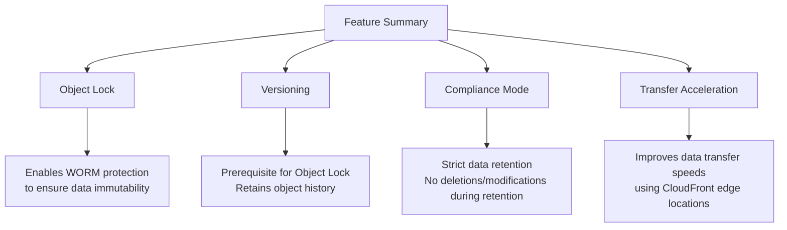

## 🔐 Amazon S3 WORM (Write Once, Read Many) with Object Lock

### 📌 What is WORM?

**WORM** stands for **Write Once, Read Many** — a data protection model that prevents any modification or deletion of data for a fixed retention period. AWS S3 supports WORM through the **Object Lock** feature.

> 🔒 Commonly used for compliance with financial and healthcare regulations (e.g., SEC Rule 17a-4(f), FINRA, HIPAA).

----------

### 🎯 Why Use WORM?

-   ✅ Guarantee **immutability** of mission-critical records.
    
-   🛡️ Prevent **accidental or malicious data deletion or updates**.
    
-   📁 Support **legal and regulatory data retention** mandates.
    
-   📊 Enable tamper-proof **audit trails** and data archiving.
    

----------

### 🔧 Object Lock Modes

| Mode        | Description                                                                 |
|-------------|-----------------------------------------------------------------------------|
| Governance  | Write/delete protection is enforced, but **authorized users** can override. |
| Compliance  | Absolute protection — **no one**, including root, can delete/alter the data. |

> 📌 **Versioning must be enabled** on the bucket to use Object Lock.

----------

## 🛠️ Step-by-Step Guide: Create an S3 Bucket with WORM + Transfer Acceleration

### 🔹 Step 1: General Configuration

Set bucket name, AWS region, and availability zone options.

----------

### 🔹 Step 2: Set Object Ownership

Leave default or customize object ownership as needed.

----------

### 🔹 Step 3: Set Public Access & Enable Versioning

-   **Block all public access** (or customize based on your needs).
    
-   **Enable versioning** – required for Object Lock.
    

----------

### 🔹 Step 4: Enable Object Lock

Scroll to the "Advanced settings" and **enable Object Lock**.

----------

### 🔹 Step 5: Create Bucket

Click **Create bucket**. Your new WORM-enabled bucket is now ready.

----------

## 📤 Upload and Lock an Object

### 🔹 Step 6: Upload a File

Upload an image or folder into your S3 bucket.

----------

### 🔹 Step 7: Choose Storage Class

Select a storage class (e.g., Standard, Intelligent-Tiering, Glacier).

----------

### 🔹 Step 8: Set Object Lock Settings

Choose the **Object Lock mode** (`Governance` or `Compliance`) and define a **retention period** (e.g., 1 year).

----------

### 🔹 Step 9: Confirm Upload

Once the file is uploaded, it becomes read-only and tamper-proof per your lock settings.

----------

## ⚡️ Enable Transfer Acceleration

To speed up uploads/downloads globally using Amazon CloudFront edge locations:

### 🔹 Step 10: Activate Transfer Acceleration

1.  Go to **Bucket → Properties**.
    
2.  Scroll to **Transfer acceleration**.
    
3.  Enable it and save changes.
    

> 🧠 Transfer acceleration works best when uploading large objects from geographically distant locations.

----------

## 🏁 Summary

