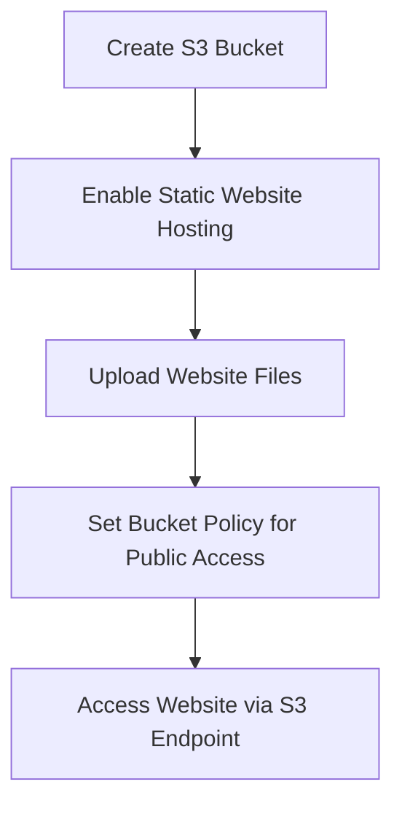

# 🌐 Hosting a Static Website on Amazon S3

This guide walks you through creating an Amazon S3 bucket, configuring it for static website hosting, setting up permissions, and accessing your hosted site.

---

## 🗺️ Architecture Overview



---

## 🪣 Step 1: Create an S3 Bucket

> ✅ Ensure bucket name is globally unique and regionally appropriate.


---

## ⚙️ Step 2: Enable Static Website Hosting

> Navigate to the **Properties** tab of the bucket and scroll to the **Static website hosting** section.


Click on **Edit**.


Add the **Index document** and optional **Error document** (e.g., `index.html`, `error.html`).


Click **Save Changes**.


---

## 📂 Step 3: Upload Static Files

> Upload your website files such as `index.html`, `error.html`, CSS, images, etc.


---

## 🔐 Step 4: Configure Bucket Policy for Public Access

> To allow public access, edit the bucket policy as shown below.


### ✅ Bucket Policy JSON

```json
{
  "Version": "2012-10-17",
  "Statement": [
    {
      "Sid": "PublicReadAccess",
      "Effect": "Allow",
      "Principal": "*",
      "Action": "s3:GetObject",
      "Resource": "arn:aws:s3:::khushalgolfclub/*"
    }
  ]
}
```


Click **Save Changes**.


---

## 🌐 Step 5: Access Your Hosted Website

> Find the website endpoint URL under the static website hosting section.


Click on the URL to view your live website:


Try entering an invalid path to test your error page:


---

## ✅ Conclusion

You have successfully:

* Created and configured an Amazon S3 bucket.
* Enabled static website hosting.
* Configured a bucket policy for public read access.
* Hosted and tested a static website on S3.

